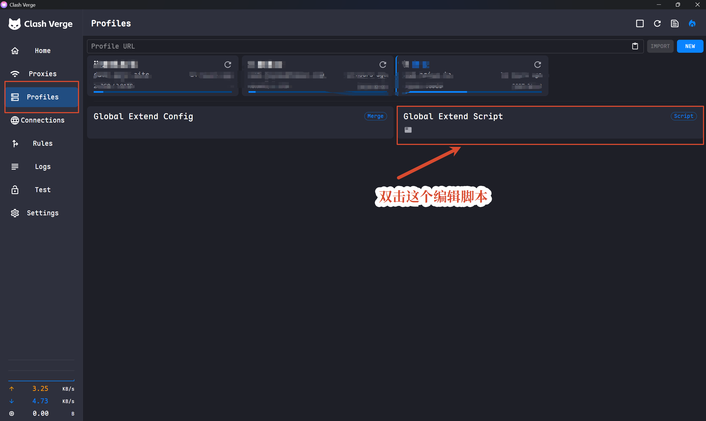

# Clash Verge AI Residential

[](https://github.com/bahayonghang/clash-verge-ai-residential/actions/workflows/ci.yml)
[](LICENSE)

Clash Verge Rev 全局扩展脚本：默认把 Claude、ChatGPT、Gemini、Google Antigravity、Cursor 和 Grok Build 的核心 AI 请求送入住宅 SOCKS5 链路。插件市场、下载、YouTube、共享 Google 服务及其他非 AI 流量仍使用原 Profile。

```text
本机 -> 当前 Profile 的机场代理组/节点 -> 家宽 SOCKS5 -> AI 服务
```

当前版本：`v5.8.0`。

## 核心边界

家宽链路包含：

- Claude / Anthropic 产品域、模型 API、MCP 代理、资产代理、MCP 和会话内容。
- ChatGPT / OpenAI 产品域、官方 9247338 列出的五个 `chat.openai.com` 家族 exact 主机、模型 API（含 Codex 的 `us.` / `eu.` 数据驻留前缀）、上传与生成内容。真实 ChatGPT 桌面/iOS Connections 结果为 UNVERIFIED。
- Gemini Web、Google AI Studio 专用后端、Gemini Developer API、Vertex AI 区域/全局模型端点。
- Google Antigravity / Gemini Code Assist 的产品域和核心 Agent API。
- Cursor Chat、Tab、Agent、代码库索引、Cloud Agent/Bugbot、授权/SSO 门户、Cloud Agent VM 和产品专属认证；`routing.cursor_core` 默认是 `true`。
- Grok Build（xAI grok CLI）推理 API 与产品域，以及 `auth.x.ai` 认证与 `api.x.ai` 直连 API；`routing.grok_core` 默认是 `true`。

家宽链路明确排除：

- Cursor Marketplace、扩展、更新、下载、CDN、Remote-SSH/WSL 资产。
- Grok Build 的 Mixpanel 分析、安装脚本（x.ai）与共享 GCS 存储域名。
- YouTube、Maps、Google Search、Fonts、Gstatic、广告和统计。
- OpenAI/Claude 的 Intercom、Sentry、Datadog、Stripe 等共享依赖。
- 公共 DoH/DoT、通用 STUN/TURN 和进程级全量代理。

完整边界见 [`docs/routing-scope.md`](docs/routing-scope.md)。

## 快速使用

需要 Node.js 18+；推荐使用 [just](https://github.com/casey/just)，但它不是必需依赖。公开模板 `clash-verge-ai-residential.js` 始终只保存占位符；真实家宽配置与开关保存在被 Git 忽略的 `clash-verge-ai-residential.local.toml`。

首次执行 `just render-local` 时，若本地配置不存在，命令会自动从示例创建 `clash-verge-ai-residential.local.toml`，提示你填写配置并结束执行。编辑 TOML 中的住宅 SOCKS5 信息和本机 Profile 的上游名称：

```toml
[home_proxy]
name = "家宽-SOCKS5"
type = "socks5"
server = "residential.example.com"
port = 1080
username = "your-username"
password = "your-password"
udp = true
dialer-proxy = "🚀节点选择"

[routing]
cursor_core = true
grok_core = true
```

填写后，生成本地 Clash Verge 脚本：

```bash
just render-local
```

没有 `just` 时，先在本地配置不存在的前提下复制示例。Windows PowerShell：

```powershell
if (-not (Test-Path clash-verge-ai-residential.local.toml)) {
  Copy-Item clash-verge-ai-residential.local.toml.example clash-verge-ai-residential.local.toml
}
```

macOS/Linux：

```bash
test -e clash-verge-ai-residential.local.toml || \
  cp clash-verge-ai-residential.local.toml.example clash-verge-ai-residential.local.toml
```

编辑 `clash-verge-ai-residential.local.toml` 中的代理值和开关，再运行：

```bash
node scripts/sync-local-config.js
```

`render-local` 是单向渲染：它会将公开模板与本地 TOML 合成为 `clash-verge-ai-residential.local.js`，不会修改公开模板。本地 TOML 缺失的开关键（含缺失的整个 `[routing]` / `[runtime]` 表）会按示例文件的默认值自动补全并写回，已有键值、注释和行尾风格保持不变。不要手动修改生成的 `.local.js`；需要调整时应修改 TOML 后重新生成。这两个本地文件都已被 `.gitignore` 排除。`just sync` 暂保留为兼容别名。完整开关、字段和校验规则见 [`docs/local-configuration.md`](docs/local-configuration.md)。

生成后，在 Clash Verge Rev 中进入 **Profiles -> Global Extend Script**：



1. 双击 **Global Extend Script**，粘贴生成的 `clash-verge-ai-residential.local.js` 全部内容并保存。
2. 刷新当前 Profile。
3. 检查生成配置中 `家宽-SOCKS5.dialer-proxy` 是否指向真实机场组。
4. 用 Connections 验证目标 AI 请求命中 `AI-家宽`，插件市场、下载、YouTube 以及显式关闭的产品不命中。

如果 Profile 已预置同名 `家宽-SOCKS5` 节点，可以让 TOML 保留 `xxx` 占位符，脚本会复用该节点的 endpoint 和凭据。无认证 SOCKS5 必须将 `username`、`password` 同时设为 `""`。

稳定 Raw 地址仍然是**不含本地凭据的公开模板**：

```text
https://raw.githubusercontent.com/bahayonghang/clash-verge-ai-residential/main/clash-verge-ai-residential.js
```

## 多 Profile

`dialer-proxy` 只能写一个名称。脚本按以下顺序解析：

1. 当前 Profile 在 `PROFILE_UPSTREAM_OVERRIDES` 中的候选。
2. 默认值 `🚀节点选择`。
3. `UPSTREAM_CANDIDATES` 中常见组名。
4. 当前配置最后一个 `MATCH` / `FINAL` 目标。
5. 全部失败则抛错，不静默回落到 `DIRECT`。

配置和限制见 [`docs/multi-profile.md`](docs/multi-profile.md)。

## DNS 行为

```text
AI 域名 DNS       -> AI-家宽 -> 家宽 SOCKS5
其他海外域名 DNS  -> 当前 Profile 的机场上游
中国域名 DNS      -> 国内 DoH / DIRECT
私有与局域网域名  -> system
```

因此普通 DNS leak test 不一定显示住宅地区。项目保证的是 AI 请求及其域名解析路径一致，而不是让所有 DNS 流量占用住宅出口。威胁边界见 [`docs/dns-and-leak-model.md`](docs/dns-and-leak-model.md)。

## 本地验证

需要 Node.js 18 或更高版本，无第三方依赖。快速运行全部标准测试：

```bash
npm test
```

提交前运行完整门禁：

```bash
just ci
```

也可直接使用 `npm run ci`，两者包含相同检查：

- JavaScript 语法检查。
- 使用 Node.js 标准测试运行器执行路由、幂等、本地 TOML 渲染和安全扫描回归测试。
- 扫描公共模板及可提交文本中的凭据与常见 token，包括 TOML。
- Gemini 默认路由、Cursor/Grok 默认路由与本地开关覆盖测试。
- YouTube、Maps、Marketplace、下载、CDN、Mixpanel 和静态资源负向测试。
- 多 Profile 解析、循环检测、DNS 收敛、托管规则替换与幂等测试。

GitHub Actions 会在 Ubuntu 的 Node.js 18、20、22 和 Windows 的 Node.js 22 上运行同一门禁。分支保护应只依赖稳定命名的 `Required checks`，该检查仅在所有矩阵任务成功时通过。

自动化不能模拟 Clash Verge Rev JavaScript 引擎、Mihomo 内核或真实订阅 Profile。涉及宿主集成、DNS 或路由的变更仍须使用脱敏后的真实 Profile 手工验证；提交日志和截图前必须移除代理地址、凭据、订阅 URL 与未脱敏 Connections 记录。

## 文档

- [`docs/local-configuration.md`](docs/local-configuration.md)：本地 TOML、`just render-local` 与凭据保护教程。
- [`docs/configuration.md`](docs/configuration.md)：开关和 Clash Verge 设置。
- [`docs/routing-scope.md`](docs/routing-scope.md)：AI-only 路由准入与排除标准。
- [`docs/multi-profile.md`](docs/multi-profile.md)：上游解析和递归保护。
- [`docs/dns-and-leak-model.md`](docs/dns-and-leak-model.md)：DNS 路径和不能单独解决的泄漏面。
- [`docs/troubleshooting.md`](docs/troubleshooting.md)：常见故障定位。
- [`SECURITY.md`](SECURITY.md)：安全报告与凭据泄漏处置。

## Domain 变更规则

新增域名必须提供官方资料或脱敏 Connections 证据，并补充负向测试。宽泛 provider suffix、插件市场、更新、下载、媒体、广告、统计和共享基础设施默认不接受。

可使用仓库的 **AI domain request** Issue 模板提交。

## 参考资料

- [Clash Verge Rev](https://github.com/clash-verge-rev/clash-verge-rev)
- [Mihomo `dialer-proxy`](https://wiki.metacubex.one/en/config/proxies/dialer-proxy/)
- [Mihomo DNS configuration](https://wiki.metacubex.one/en/config/dns/)
- [Mihomo rules](https://wiki.metacubex.one/en/config/rules/)
- [Anthropic IP addresses](https://docs.anthropic.com/en/api/ip-addresses)
- [Google Gemini API](https://ai.google.dev/gemini-api/docs)
- [Google AI Studio](https://ai.google.dev/aistudio)

## License

[MIT](LICENSE)
